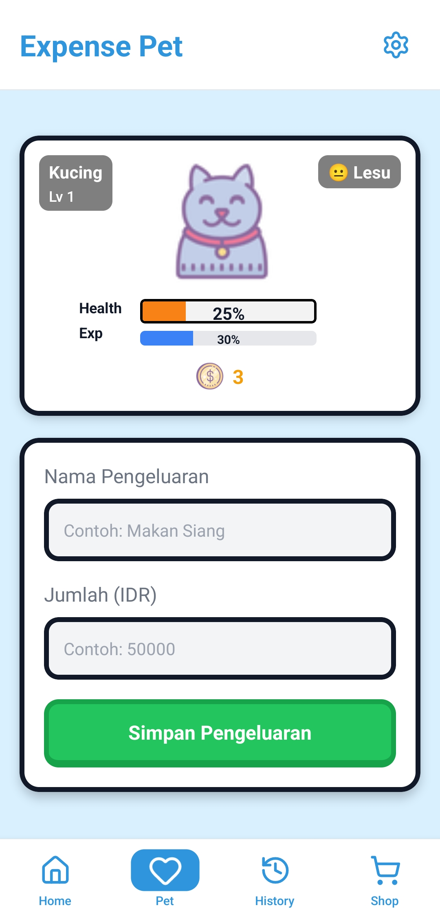

# Expense Pet

[](https://reactnative.dev/)  
[](https://expo.dev/)  
[](LICENSE)

**Expense Pet** adalah aplikasi mobile unik yang membantu pengguna **mengatur pengeluaran sehari-hari** sekaligus **merawat hewan peliharaan virtual**. Pengeluaran yang dicatat akan memengaruhi kondisi hewan peliharaanmu.  

---

## Fitur

- Pelihara hewan virtual dengan kondisi yang berubah sesuai pengeluaran.  
- Catat pengeluaran harian dengan mudah.  
- Ringkasan pengeluaran mingguan atau bulanan.  
- Notifikasi pengingat pencatatan pengeluaran.  
- Tema responsif untuk berbagai ukuran layar Android.  

---

## Icon & Screenshot


### Icon APK
<p align="center">
  
</p>

### Tampilan Aplikasi (APK)
<p align="center">
  
  
</p>

---

## Download APK

Kamu bisa langsung download APK dan coba di HP Androidmu:   

[](https://github.com/Leancyn/expense-pet/releases/download/v1.1.0/ExpensePet_v1.1.0.apk)


---

## Instalasi (Untuk Developer)

1. Clone repository:  

```bash
git clone https://github.com/Leancyn/expense-pet.git
cd expense-pet
